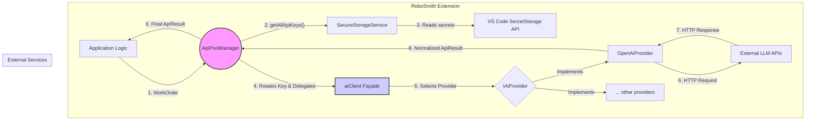

# **AI Service Layer: Detailed Specification**

## 1. High-Level Summary

This specification defines the architecture for a robust, economically viable, and maintainable service layer responsible for handling all outgoing Large Language Model (LLM) API calls. The design is a direct implementation of the project's core principles:

*   **Economic Viability:** Minimize API costs by intelligently managing a pool of keys, maximizing free tiers, and handling failures gracefully. [cite: docs/architecture/RoboSmith_spec.md]
*   **Robustness:** Ensure the system can withstand common, transient API failures (e.g., rate limiting) without interrupting the user's workflow. [cite: docs/architecture/RoboSmith_spec.md]
*   **Separation of Concerns:** Create a modular system where each component has a single, well-defined responsibility, ensuring clarity, testability, and extensibility.

## 2. Architectural Block Diagram

The service layer is composed of a stateful orchestrator that uses a stateless façade to delegate work to provider-specific modules. This de-couples the complex state management of key rotation from the simple, stateless logic of making a network call.



---

## 3. Component Specifications

This feature is implemented across several distinct, single-responsibility files.

### **3.1. The Contracts (`types.ts`)**

*   **File Path:** `packages/client/src/lib/ai/types.ts`
*   **Architectural Role:** `Type Definition`
*   **Core Responsibilities:**
    *   To define the immutable data contracts that govern all interactions within the AI Service Layer.
    *   To contain no executable logic.
*   **Data Contracts:**
    ```typescript
    export interface ApiKey {
      id: string;
      secret: string;
      provider: 'openai' | 'google' | 'anthropic';
    }

    export interface WorkOrder {
      model: string;
      prompt: string;
      temperature?: number;
      maxTokens?: number;
    }

    export interface ApiResult {
      success: boolean;
      content?: string;
      error?: string;
      tokensUsed?: number;
      apiKeyId?: string;
    }
    ```

### **3.2. The Secure Key Storage (`SecureStorageService.ts`)**

*   **File Path:** `packages/client/src/lib/ai/SecureStorageService.ts`
*   **Architectural Role:** `Configuration`
*   **Core Responsibilities:**
    *   To be the single, authoritative wrapper around the `vscode.SecretStorage` API.
    *   To handle the serialization and deserialization of `ApiKey` objects for secure storage.
*   **Public API:**
    ```typescript
    export class SecureStorageService {
      constructor(secretStorage: vscode.SecretStorage);
      async storeApiKey(key: ApiKey): Promise<void>;
      async getAllApiKeys(): Promise<Record<string, ApiKey>>;
      async removeApiKey(keyId: string): Promise<void>;
    }
    ```

### **3.3. The Provider Contract (`IAiProvider.ts`)**

*   **File Path:** `packages/client/src/lib/ai/providers/IAiProvider.ts`
*   **Architectural Role:** `Type Definition`
*   **Core Responsibilities:**
    *   To define the strict `IAiProvider` interface, which acts as the formal contract for all provider-specific implementations. This makes all providers interchangeable.
*   **Public API:**
    ```typescript
    export interface IAiProvider {
      generateCompletion(apiKey: ApiKey, workOrder: WorkOrder): Promise<ApiResult>;
    }
    ```

### **3.4. The Provider Implementation (`OpenAiProvider.ts`)**

*   **File Path:** `packages/client/src/lib/ai/providers/OpenAiProvider.ts`
*   **Architectural Role:** `Business Logic`
*   **Core Responsibilities:**
    *   To provide a concrete implementation of the `IAiProvider` interface for the OpenAI API.
    *   To encapsulate all logic for formatting OpenAI-specific requests, executing network calls, and parsing responses.
*   **Public API:**
    ```typescript
    export class OpenAiProvider implements IAiProvider {
      public async generateCompletion(apiKey: ApiKey, workOrder: WorkOrder): Promise<ApiResult>;
    }
    ```

### **3.5. The Provider Façade (`aiClient.ts`)**

*   **File Path:** `packages/client/src/lib/ai/aiClient.ts`
*   **Architectural Role:** `Orchestrator` (Stateless Façade)
*   **Core Responsibilities:**
    *   To act as a stateless factory for AI providers.
    *   To select and delegate calls to the correct concrete provider module based on the `provider` property of the `ApiKey`.
*   **Public API:**
    ```typescript
    export const aiClient = {
      generateCompletion(apiKey: ApiKey, workOrder: WorkOrder): Promise<ApiResult>;
    };
    ```

### **3.6. The Core Orchestrator (`ApiPoolManager.ts`)**

*   **File Path:** `packages/client/src/lib/ai/ApiPoolManager.ts`
*   **Architectural Role:** `Orchestrator` (Stateful Singleton)
*   **Core Responsibilities:**
    *   To act as the sole, stateful entry point for all LLM calls from the application.
    *   To implement the "failover-driven round-robin" logic.
    *   To manage the state of the key pool, including cooldowns for failed keys.
    *   To delegate the actual network call to the stateless `aiClient`.
*   **Public API:**
    ```typescript
    export class ApiPoolManager {
      public static getInstance(secureStorage: SecureStorageService): ApiPoolManager;
      public async initialize(): Promise<void>;
      public async execute(workOrder: WorkOrder): Promise<ApiResult>;
    }
    ```
*   **Detailed Behavioral Logic (Failover-Driven Round-Robin):**
    1.  The `ApiPoolManager` is a singleton that maintains its internal state: a list of available `ApiKey`s, the index of the next key to try, and a map of keys on temporary cooldown.
    2.  When `execute` is called, it begins a loop through its available keys, starting from its `nextKeyIndex`.
    3.  For each key, it delegates the call to the `aiClient`, which in turn calls the correct provider (e.g., `OpenAiProvider`).
    4.  **On Success:** The `ApiPoolManager` updates its `nextKeyIndex` to point to the next key in the sequence for the subsequent call and returns the successful `ApiResult`. The loop terminates.
    5.  **On Failure (Retryable):** If the provider returns a result indicating a retryable error (e.g., HTTP 429 rate limit), the `ApiPoolManager` catches it, places the failed key's ID on a temporary cooldown, and continues the loop to the next available key.
    6.  **On Failure (Non-Retryable):** If the error is non-retryable (e.g., HTTP 401 invalid key), it immediately returns a failed `ApiResult`. The loop terminates.
    7.  If the loop completes without a single successful call, it returns a final failed `ApiResult`, indicating that all keys in the pool are currently unavailable.

---

## 4. Testing Strategy

The components of this service layer are classified as **CRITICAL** and require mandatory unit testing.

*   **`SecureStorageService.ts`:** Unit tests must mock the `vscode.SecretStorage` API to verify correct serialization, storage, and retrieval of key data.
*   **`OpenAiProvider.ts`:** Unit tests must mock the global `fetch` API to verify that the provider correctly formats outgoing request bodies and correctly parses both successful and error responses from the network.
*   **`aiClient.ts`:** Unit tests must verify that the client correctly instantiates and delegates calls to the appropriate mocked provider based on the `ApiKey`'s `provider` field.
*   **`ApiPoolManager.ts`:** Unit tests are mandatory and must cover:
    *   Correct round-robin key selection for consecutive successful requests.
    *   Successful failover to a second key when the first is mocked to return a rate-limit error.
    *   Immediate failure when a non-retryable error is encountered.
    *   Graceful failure when all keys in the pool are exhausted.