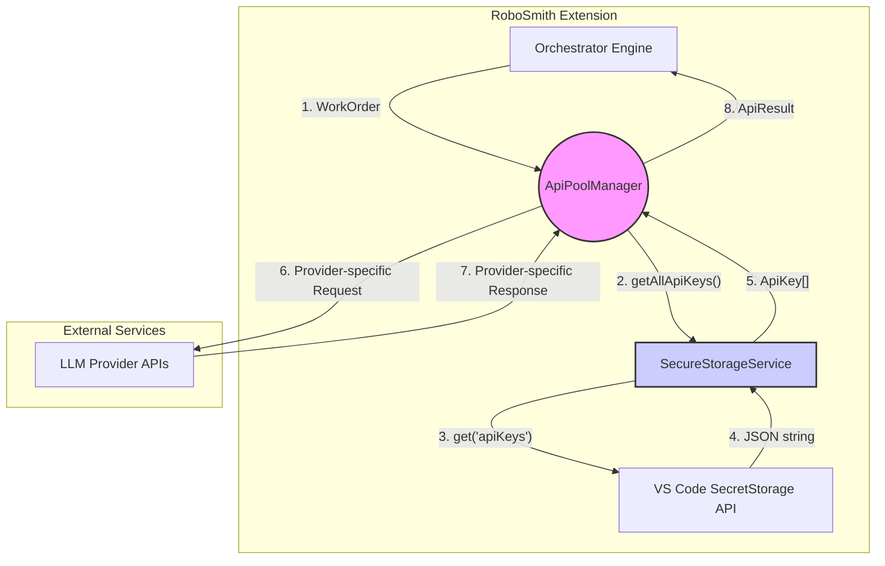

---

### **AI Service Layer: Detailed Specification**

**1. High-Level Summary**

This specification defines the architecture for a robust, economically viable, and maintainable service layer responsible for handling all outgoing Large Language Model (LLM) API calls.

The design is governed by the following core principles from the project's documentation:
*   **Economic Viability:** To minimize API costs by intelligently managing a pool of keys, maximizing free tiers, and handling failures gracefully. [cite: RoboSmith_spec.md]
*   **Robustness:** To ensure the system can withstand common API failures (e.g., rate limiting) without interrupting the user's workflow. [cite: RoboSmith_spec.md]
*   **Separation of Concerns:** To create a modular system where each component has a single, well-defined responsibility, ensuring clarity and testability. [cite: docs/architecture/Horizontal_Principles.MD]

**2. Architectural Block Diagram**

The service layer is composed of three internal components that orchestrate requests from the main `Orchestrator Engine` to external LLM providers.



---

**3. Component Specifications**

This feature will be implemented across three distinct files.

#### **3.1. The Contracts (`types.ts`)**

- **File Path:** `packages/client/src/lib/ai/types.ts`
- **Architectural Role:** `Type Definition`
- **Core Responsibilities:**
  - To define the immutable data contracts that govern all interactions within the AI Service Layer.
  - To contain no executable logic.
- **Data Contracts:**

  ```typescript
  /**
   * @id packages/client/src/lib/ai/types.ts#ApiKey
   * @description Represents a single, identifiable API key with its provider metadata. This is the shape that will be securely stored.
   */
  export interface ApiKey {
    /** A unique identifier for the key within the pool, e.g., 'openai-personal-1'. */
    id: string;
    /** The secret API key value. */
    secret: string;
    /** The provider this key belongs to, used for routing logic. */
    provider: 'openai' | 'google' | 'anthropic';
  }

  /**
   * @id packages/client/src/lib/ai/types.ts#WorkOrder
   * @description The AI-agnostic payload sent by the Orchestrator to the ApiPoolManager. It defines the "what" of the request.
   */
  export interface WorkOrder {
    /** The specific model to be used, e.g., 'gpt-4o', 'gemini-1.5-flash'. */
    model: string;
    /** The fully assembled prompt to be sent to the model. */
    prompt: string;
    /** The creativity parameter for the model, from 0.0 to 1.0. */
    temperature?: number;
    /** The maximum number of tokens to generate in the response. */
    maxTokens?: number;
  }

  /**
   * @id packages/client/src/lib/ai/types.ts#ApiResult
   * @description The standardized response object returned by the ApiPoolManager. It normalizes the output from any provider.
   */
  export interface ApiResult {
    /** A boolean indicating if the API call was ultimately successful. */
    success: boolean;
    /** The string content of the LLM's response, if successful. */
    content?: string;
    /** A description of the error, if the call failed. */
    error?: string;
    /** The token usage data returned by the API, for logging and auditing. */
    tokensUsed?: number;
    /** The ID of the ApiKey that successfully fulfilled the request, for debugging. */
    apiKeyId?: string;
  }
  ```

#### **3.2. The Secure Key Storage (`SecureStorageService.ts`)**

- **File Path:** `packages/client/src/lib/ai/SecureStorageService.ts`
- **Architectural Role:** `Configuration`
- **Core Responsibilities:**
  - To be the single, authoritative wrapper around the `vscode.SecretStorage` API.
  - To handle the serialization and deserialization of `ApiKey` objects for secure storage.
  - To have no knowledge of API providers or network requests.
- **Public API:**

  ```typescript
  import * as vscode from 'vscode';
  import { ApiKey } from './types';

  export class SecureStorageService {
    constructor(secretStorage: vscode.SecretStorage);
    async storeApiKey(key: ApiKey): Promise<void>;
    async getAllApiKeys(): Promise<Record<string, ApiKey>>;
    async removeApiKey(keyId: string): Promise<void>;
  }
  ```

#### **3.3. The Orchestrator (`ApiPoolManager.ts`)**

- **File Path:** `packages/client/src/lib/ai/ApiPoolManager.ts`
- **Architectural Role:** `Orchestrator`
- **Core Responsibilities:**
  - To act as the sole entry point for all LLM calls from the application.
  - To implement the "key carousel" (round-robin) and "failover-driven" logic.
  - To manage the state of the key pool, including cooldowns for failed keys.
  - To abstract away all provider-specific implementation details.
- **Public API:**

  ```typescript
  import { SecureStorageService } from './SecureStorageService';
  import { WorkOrder, ApiResult } from './types';

  export class ApiPoolManager {
    public static getInstance(secureStorage: SecureStorageService): ApiPoolManager;
    public async initialize(): Promise<void>;
    public async execute(workOrder: WorkOrder): Promise<ApiResult>;
  }
  ```

- **Detailed Behavioral Logic (The "Key Carousel"):**
  1.  The `ApiPoolManager` will be a singleton, maintaining an internal array of `ApiKey` objects and an index pointer, `lastUsedKeyIndex`.
  2.  Upon receiving a `WorkOrder` via the `execute` method, it will get a list of candidate keys by filtering out any keys currently in a temporary cooldown state.
  3.  It will determine the starting point for its search in the candidate list by using `(lastUsedKeyIndex + 1) % candidateKeys.length`.
  4.  It will loop through the candidate keys, starting from this point.
  5.  For each key, it will attempt to make the API call within a `try/catch` block.
      - **On Success:** The `lastUsedKeyIndex` is updated to the index of the successful key. A successful `ApiResult` is returned to the caller. The loop terminates.
      - **On Failure:** The error is inspected. If it is a retryable error (e.g., HTTP `429`, `500`, `503`), the failed key's `id` is added to a cooldown map with a timestamp. The loop continues to the next key. If the error is non-retryable (e.g., HTTP `401`, `403`), a failed `ApiResult` is returned immediately, and the loop terminates.
  6.  If the loop completes without a single successful call, a final failed `ApiResult` is returned, indicating that all keys are currently unavailable.

---

**4. Testing Strategy**

Adhering to "The Definitive AiAnvil Testing Standard," the components of this service layer are classified as follows:

- **`types.ts`:**
  - **Criticality:** N/A. Contains no logic.
  - **Testing:** Not required.

- **`SecureStorageService.ts`:**
  - **Criticality:** **CRITICAL**. Meets rubric point #6: "Security & Authentication Context." [cite: testing_standard.md]
  - **Testing:** **Unit Tests are Mandatory**. The tests will mock the `vscode.SecretStorage` interface to verify that the service correctly stores, retrieves, and removes serialized key data without errors.

- **`ApiPoolManager.ts`:**
  - **Criticality:** **CRITICAL**. Meets rubric points #2 ("Core Business Logic Orchestration") and #5 ("I/O & Concurrency Management"). [cite: testing_standard.md]
  - **Testing:** **Unit Tests are Mandatory**. Tests must cover:
    - Correct round-robin key selection ("key carousel").
    - Successful failover from a rate-limited key to the next available key.
    - Correct handling of the cooldown mechanism.
    - Graceful failure when all keys in the pool are exhausted.
    - The `SecureStorageService` and all external network calls will be mocked.
