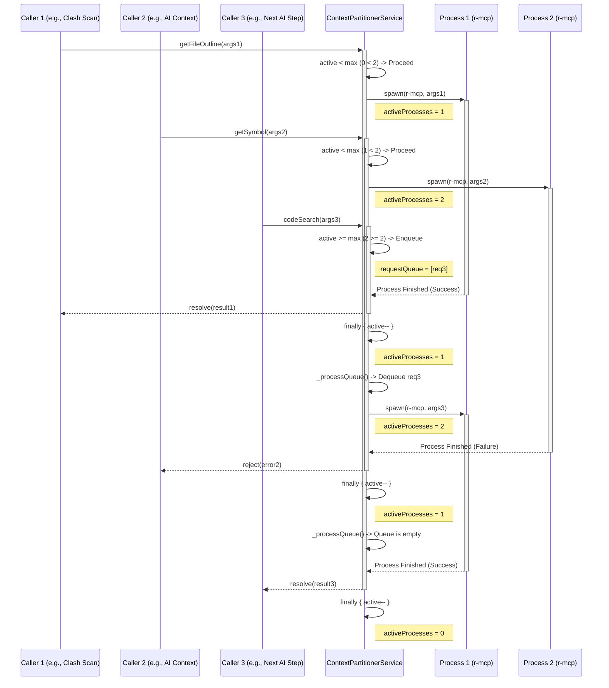

# **`roberto-mcp`: Integration & Strategy (V2 - Detailed Engineering Spec)**

## 1. Executive Summary & Rationale

This document provides the definitive engineering specification for integrating the `roberto-mcp` Rust server. It supersedes all previous high-level discussions.

The project has formally adopted the **"One-Shot with Persistent Cache"** model. This architecture provides the necessary semantic code analysis with a "good enough" performance profile for our asynchronous workflow, while drastically reducing the memory overhead and implementation complexity associated with a persistent server-per-tab model.

This document contains the explicit modification plan for the `roberto-mcp` binary and the precise data flow diagrams and algorithms for the consuming `ContextPartitionerService`. It is the authoritative source of truth for this integration.

## 2. Core MCP Data Contracts

For the `ContextPartitionerService` to function, it must adhere to the JSON contracts of the `roberto-mcp` tools. The following TypeScript interfaces represent the expected shapes for the most critical tools.

```typescript
// For the 'get_file_outline' tool
interface FileOutlineParams {
  file_path: string;
}
interface FileOutlineResult {
  filePath: string;
  functions: Array<{ name: string; signature: string; lineRange: [number, number] }>;
  classes: Array<{ name: string; lineRange: [number, number] }>;
  // ... and other symbol types like imports, types, etc.
}

// For the 'get_symbol_references' tool
interface SymbolReferencesParams {
  name: string; // The name of the symbol to find references for
}
interface SymbolReferencesResult {
  references: Array<{
    filePath: string;
    line: number;
    character: number;
  }>;
}

// For the 'code_search' tool
interface CodeSearchParams {
  query: string;
  max_results?: number;
}
interface CodeSearchResult {
  results: Array<{
    filePath: string;
    line: number;
    score: number; // BM25 relevance score
    lineText: string;
  }>;
}
```

## 3. `roberto-mcp`: The Modification Plan

To support the "One-Shot" model, the `roberto-mcp` binary requires a targeted modification to add a command-line execution path that coexists with the existing persistent server path.

### 3.1. File-by-File Change Analysis
| File Path | Change Required | Rationale |
| :--- | :--- | :--- |
| **`Cargo.toml`** | **Add Dependency** | The `clap` crate (v4.5+) with the `derive` feature is required for robust, structured command-line argument parsing. |
| **`src/main.rs`** | **Major Modification** | The `main` function will be refactored to parse CLI arguments first. Based on these arguments, it will either enter the new "one-shot" logic path or fall back to the existing persistent server loop. |
| **`src/mcp/tools.rs`** | **Minor Refactoring** | The core `match` statement that routes a tool name to its implementation function must be extracted into a standalone, reusable `async` function. This allows both the server and one-shot modes to share the exact same tool execution logic, preventing code duplication. |
| **`tests/`** | **Add New Test File** | A new integration test, `oneshot_mode_test.rs`, will be created to validate the new CLI entry point using `assert_cmd`. |

### 3.2. Detailed Implementation of the "One-Shot" Path

The modification centers on a new `Cli` struct and a branch in the `main` function.

**1. Define the CLI Structure (in `src/main.rs`):**

```rust
use clap::Parser;

#[derive(Parser, Debug)]
#[command(author, version, about, long_about = None)]
struct Cli {
    /// Run in one-shot mode to execute a single command and exit.
    #[arg(long)]
    oneshot: bool,

    /// The name of the MCP tool to execute (e.g., 'get_file_outline').
    #[arg(long, requires = "oneshot")]
    tool: Option<String>,

    /// The JSON string of parameters for the specified tool.
    #[arg(long, requires = "oneshot")]
    params: Option<String>,
}
```

**2. Refactor the `main` function (in `src/main.rs`):**

The `main` function will be structured to first parse these arguments.

```rust
#[tokio::main]
async fn main() -> Result<()> {
    // ... (logging setup)
    
    let cli = Cli::parse();

    if cli.oneshot {
        // --- NEW ONE-SHOT PATH ---
        // 1. Validate and extract CLI arguments.
        let tool_name = cli.tool.unwrap();
        let params_json = cli.params.unwrap();
        
        // 2. Deserialize the JSON string into a generic JSON Value.
        let params: serde_json::Value = serde_json::from_str(&params_json)?;
        
        // 3. **CRITICAL**: Initialize the core analysis engine. This reuses the
        //    same logic the persistent server uses to find/validate/load the cache.
        //    This is NOT a "cold" run. It's a fast, incremental-aware startup.
        let analysis_tools = roberto_mcp::CodeAnalysisTools::new();
        
        // 4. Call the refactored, standalone dispatch function.
        let result = roberto_mcp::mcp::tools::dispatch_tool_call(&analysis_tools, &tool_name, params).await;

        // 5. Serialize and print the result based on success or failure.
        match result {
            Ok(call_result) => {
                let output = serde_json::to_string(&call_result.content)?;
                println!("{}", output); // Success JSON to stdout
                Ok(())
            }
            Err(error_data) => {
                let error_output = serde_json::to_string(&error_data)?;
                eprintln!("{}", error_output); // Error JSON to stderr
                std::process::exit(1);
            }
        }
    } else {
        // --- EXISTING PERSISTENT SERVER PATH (UNCHANGED) ---
        // ... (existing code to start the stdio server)
    }
}
```

## 4. `ContextPartitionerService`: Data Flow & Logic

The service implements a concurrency-limited queue to manage requests to the `roberto-mcp` binary.

### 4.1. Data Flow 1: The Request Queueing Mechanism

This diagram illustrates how multiple concurrent requests are managed to prevent system overload.



### 4.2. Data Flow 2: A Single "One-Shot" Execution

This diagram details the lifecycle of a single request that has been dequeued for execution.

```mermaid
graph TD
    A[CPS: _processQueue()] --> B{Dequeue Request};
    B --> C[Construct CLI Arguments<br/>--oneshot, --tool, --params];
    C --> D[spawn("roberto-mcp", args)];
    D --> E{Wait for Exit};
    
    subgraph "r-mcp Process"
        F[Start] --> G[Validate/Load Cache];
        G --> H[Perform Incremental Re-index<br/>(if needed)];
        H --> I[Execute Tool Logic];
        I --> J{Success?};
    end

    J -- Yes --> K[Print JSON to stdout<br/>Exit Code 0];
    J -- No --> L[Print Error JSON to stderr<br/>Exit Code 1];

    K --> E;
    L --> E;

    E --> M{Exit Code === 0?};
    M -- Yes --> N[Parse stdout JSON];
    M -- No --> O[Read stderr];

    N --> P[request.resolve(parsedJson)];
    O --> Q[request.reject(ProcessExecutionError)];

    subgraph "Finally Block"
      R[Decrement activeProcessCount];
      R --> S[Call _processQueue() again];
    end
    
    P --> R;
    Q --> R;
```