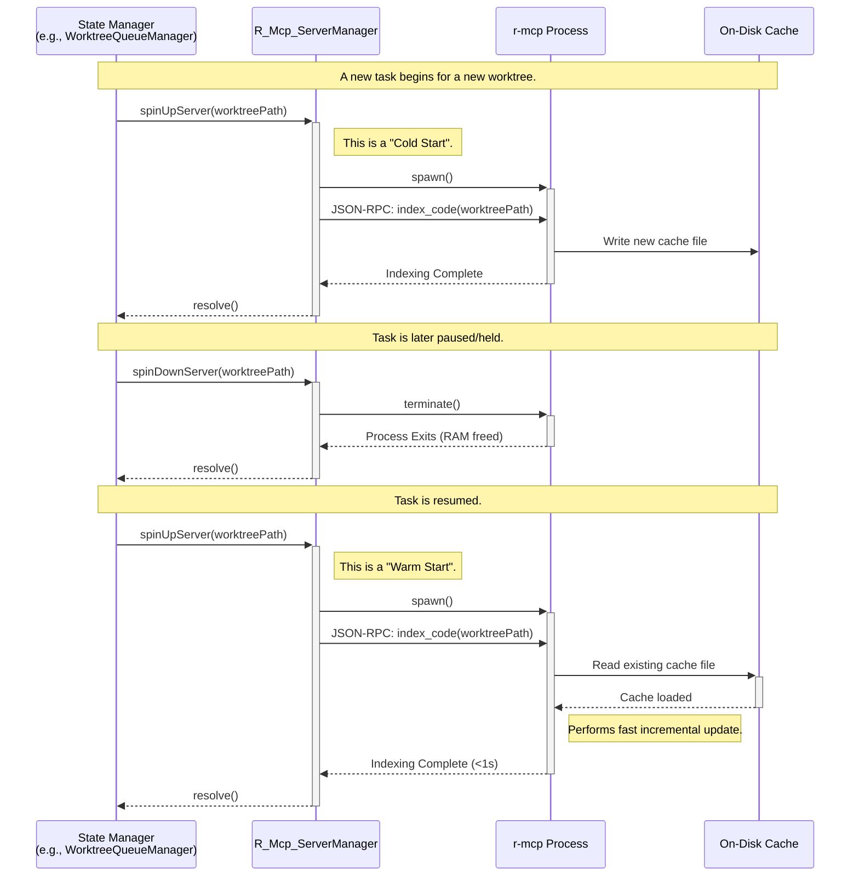
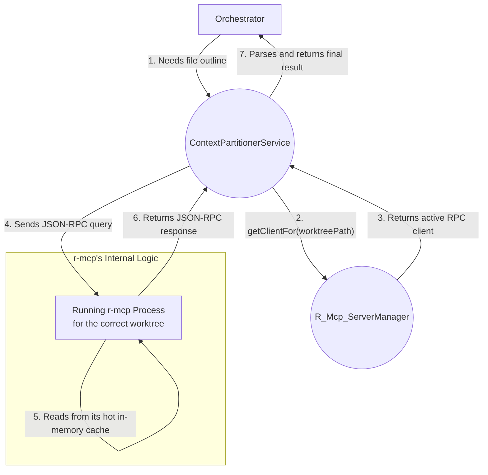

---

# **`roberto-mcp`: Integration & Strategy (Definitive Architecture)**

## 1. Executive Summary & Rationale

This document provides the definitive engineering specification for integrating the `roberto-mcp` Rust engine. It supersedes all previous discussions and formally adopts the **"On-Demand Server-per-Worktree"** model.

This architecture is designed to fully leverage the native, high-performance capabilities of `roberto-mcp` as a persistent server, including its built-in file watcher and on-disk caching, which provide near-instantaneous incremental updates.

To balance performance with resource efficiency, the extension will not run a server for every worktree at all times. Instead, a new **`R_Mcp_ServerManager`** service will be responsible for the lifecycle of these server processes. It will dynamically "spin up" a dedicated server instance only when a workflow becomes active (`Running`) and "spin it down" when the workflow becomes inactive (`Held`, `Completed`). This on-demand approach provides the sub-second query performance of a hot, in-memory cache precisely when it's needed, while conserving memory and CPU resources for all inactive tasks.

This strategy completely eliminates the need for a manual concurrency queue and any modifications to the `roberto-mcp` binary, resulting in a simpler, more robust, and higher-performance implementation.

## 2. Core `r-mcp` Data Contracts

The `ContextPartitionerService` communicates with `r-mcp` server instances via JSON-RPC. The following TypeScript interfaces define the expected request and response shapes for the critical `r-mcp` tools.

```typescript
// For the 'get_file_outline' tool
interface FileOutlineParams {
  file_path: string;
}
interface FileOutlineResult {
  filePath: string;
  functions: Array<{ name: string; signature: string; lineRange: [number, number] }>;
  classes: Array<{ name: string; lineRange: [number, number] }>;
  // ... and other symbol types like imports, types, etc.
}

// For the 'get_symbol_references' tool
interface SymbolReferencesParams {
  name: string; // The name of the symbol to find references for
}
interface SymbolReferencesResult {
  references: Array<{
    filePath: string;
    line: number;
    character: number;
  }>;
}

// For the 'code_search' tool
interface CodeSearchParams {
  query: string;
  max_results?: number;
}
interface CodeSearchResult {
  results: Array<{
    filePath: string;
    line: number;
    score: number; // BM25 relevance score
    lineText: string;
  }>;
}
```

## 3. System Architecture

The integration is built on three core components: the `GitWorktreeManager`, which signals state changes; the new `R_Mcp_ServerManager`, which manages the server processes; and the refactored `ContextPartitionerService`, which routes queries to the correct running server.

### Component 1: The `R_Mcp_ServerManager` (The Process Orchestrator)
*   **Architectural Role:** `Process Orchestrator`
*   **Core Responsibilities:**
    *   To maintain an in-memory map of all active `roberto-mcp` server processes, keyed by their `worktreePath`.
    *   To manage the complete lifecycle of each server process based on external commands.
    *   To expose a clean, asynchronous API for spinning servers up and down.
    *   To provide a synchronous method for retrieving the JSON-RPC client for an already-running server.
*   **Public API (TypeScript Signature):**
    ```typescript
    export class R_Mcp_ServerManager {
      public static getInstance(): R_Mcp_ServerManager;

      /**
       * Spawns an r-mcp server, sends the initial 'index_code' command,
       * and waits for the initial indexing to complete. Leverages r-mcp's
       * on-disk cache for fast "warm starts".
       */
      public async spinUpServer(worktreePath: string): Promise<void>;

      /**
       * Gracefully terminates the r-mcp server process for a given worktree,
       * freeing its memory resources. The on-disk cache remains.
       */
      public async spinDownServer(worktreePath: string): Promise<void>;

      /**
       * Returns the JSON-RPC client for the specified worktree, allowing other
       * services to send queries. Returns undefined if no server is running.
       */
      public getClientFor(worktreePath: string): JsonRpcClient | undefined;
    }
    ```

### Component 2: The `ContextPartitionerService` (The Query Router)
*   **Architectural Role:** `Stateless Façade`
*   **Core Responsibilities:**
    *   To act as the single, authoritative entry point for all context *queries*.
    *   To be completely stateless and unaware of process management.
    *   To translate its public method calls into the correct JSON-RPC `tools/call` message format.
    *   To route the query to the correct, running server instance by requesting the appropriate client from the `R_Mcp_ServerManager`.
*   **Detailed Behavioral Logic:**
    1.  A method like `getFileOutline({ worktreePath, filePath })` is called.
    2.  The service immediately calls `rMcpServerManager.getClientFor(worktreePath)`.
    3.  If no client is returned (i.e., the server isn't running), it throws an error.
    4.  It uses the obtained client to construct and send the JSON-RPC message for the `get_file_outline` tool.
    5.  It awaits the JSON response, parses it, and returns the result.

## 4. Data Flow & Logic

### 4.1. Data Flow 1: The On-Demand Lifecycle

This diagram illustrates how a server process is managed based on the workflow's state, highlighting the "cold start" and "warm start" paths enabled by `r-mcp`'s persistent on-disk cache.



### 4.2. Data Flow 2: A Single Context Query

This diagram shows the clean, simple path for a context query, demonstrating the separation of concerns between the services.

